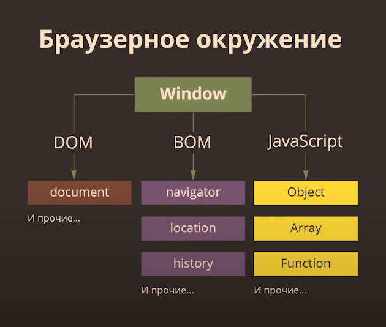
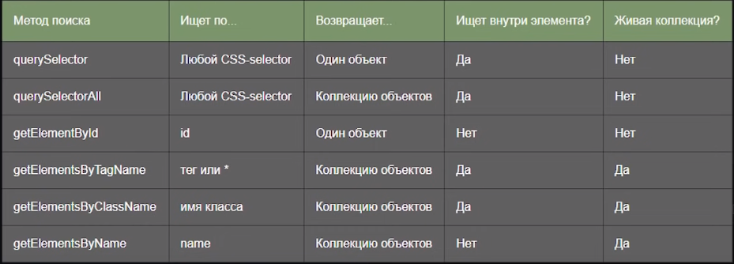
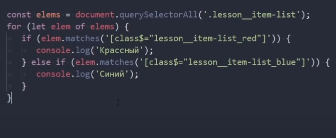
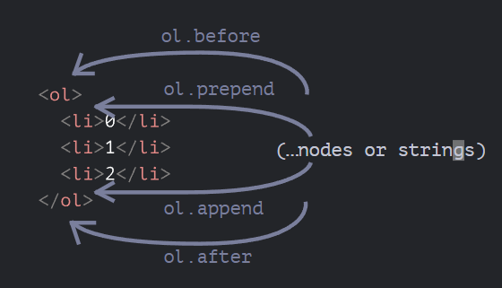
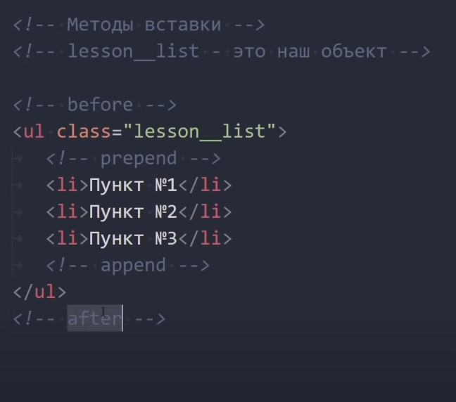

 #### Tags:
  #js #💻  #🌱
---	
 

	


# <span style="color: #42F5EC;">Навигация по DOM элементам </span>

#### `childNodes`

```JS
// Получаем объект body
    const bodyElement = document.body;
I
//Коллекция chiLdNodes содержит список всех demeiij //включая текстовые узлы.
	const childNodes = bodyElement.childNodes; 
	console.log(childNodes);
	
//Цля проверки наличия дочерних узлов
//существует также специальная функция hasChiLdNodes() 
	console.log(bodyElement.hasChildNodes());
------------------------------------------------------

```

Навигация по документу
`previousSibling`
`nextSibling`
`parentNode`
```JS

// Получаем объект body 
const bodyElement = document.body;

// Соседние и родительский узлы
const previousSiblingNode = bodyElement.previousSibling; const nextSiblingNode = bodyElement.nextSibling;
const parentNode = bodyElement.parentNode;

console.log(previousSiblingNode); 
console.log(nextSiblingNode);
console.log(parentNode);
------------------------------------------------------

```


## `for of `

```JS
// querySeLectorALL - статичная коллекция
// Получение конкретного элемента коллекции 

const elems = document.querySelectorAll('li'); console.log(elems[2]);

	for (const item of elems) { 
	console.log(item);
}

	elems.forEach(item => { 
	console.log(item);
});
------------------------------------------------------
фор прокрутит, найдет все элементы li
```


## Поиск произвольного элемента 

### `querySelectorAll`

```JS
const lessonList = document.querySelectorAll('.lesson__list')[0];
------------------------------------------------------

```

##### Получение конкретного элемента
```JS
let textTitle = document.querySelectorAll('li')
    console.log(textTitle[2]);
    
    for (const item of textTitle) {
        console.log(textTitle);
}
------------------------------------------------------
► li.menu	item	script.is:5

NodeList(4) [Li.menu	item, Li.menu	 Li.menu	item, Li.menu	item]	script."is:8 item j

^NodeList(4) [Li.menu	item, Li.menu	 Li.menu	iterrij Li.menu	item]	script."is:8 item j

^NodeList(4) [Li.menu	item, Li.menu	 Li.menu	iterrij Li.menu	item]	script."is:8 item j

^NodeList(4) [Li.menu	item, Li.menu	 Li.menu	iterrij Li.menu	item]	script."is:8 item j
```


Искать можно не только в document
[0] - порядок элемента в определённого объекта 
```JS
const subList = document.querySelectorAll(1.lesson___sub-list');
const subItems = subList[0].querySelectorAll('li');
console.log(subItems);
------------------------------------------------------

```


### `eLem.querySeLector`

Возвращает первый элемент внутри elem, соответствующий данному CSS-селектору.
```JS
const LessonList = document.querySeLector(Lesson_____List1);
console.log(lessonList);
------------------------------------------------------

```
	
### `document.getELementByld`

Если у элемента есть атрибут id, то мы можем получить его вызовом document.getElementById(id) где бы он ни находился.

```js
const elem = document.getElementByld('listitem'); console.log(elem);

/*
1.//	id - уникален
2.	Поиск полько внутри document.
*/	
	
```
	
```JS
// Получаем статическую коллекцию
const listStatic = document.querySelectorAll(lesson____item-list');

						
// Получаем "живую" коллекцию
const listLive = document.getElementsByClassName('lesson__item-list')
console.log(listStatic);
console.log(listLive);

// Создаем новый HTML-объект.
const lessonList = document.querySelector(lesson_____list');
~lessonList.insertAdjacentHTML(
"beforeend",
'<li class="lesson__item-list">HoBbiii пункт</И>’
------------------------------------------------------

```

```js
	  

const textElement = document.querySelector('.title');

  
  

const newElement = document.createElement('a');

newElement.innerHTML = 'Живи всу дела !';

  
  

const textElement2 = document.querySelector('.block__one');

  
  

const newElement2 = document.createElement('a');

newElement2.innerHTML = 'learen <br>learen learen<br> learen <br>learen<br> learen';

  
  

textElement.after(newElement, `Привет! newElement, newElement, newElement, `);

  

textElement2.prepend(newElement2);

  

     textElement.innerHTML = '23412411412341';

  

  console.log(newElement);

     console.log(textElement);

  
  

     let div = document.createElement('div');

     div.className = "title";

     div.innerHTML = "<strong>Всем привет!</strong> Вы прочитали важное сообщение.";

     document.body.before(div);
```


### `cLosest`

Метод elem.closest(css) ищет ближайшего предка, который соответствует CSS - селектору. Сам элемент также включается в поиск.
Предки элемента это родитель, родитель родителя, его родитель и так далее. Вместе они образуют цепочку иерархии от элемента до вершины.
Другими словами, метод closest поднимается вверх от элемента и проверяет каждого из родителей. Если он соответствует селектору, поиск прекращается. Метод возвращает либо предка, либо null, если такой элемент не найден.
Напомню свойство parentElement возвращает только непосредственного родителя элемента

```js
const elem = document.querySelector('.lesson___item-sub-list’)
const parentList = elem.closest(’.lesson___list’);
console.log(parentList);
```

Очень полезный метод, часто используется для проверки на существование того или иного родителя, либо для изменения родителя конкретного элемента	
	
### Проверка `matches`

ничего не ищет, а проверяет, удовлетворяет ли элемент CSS-селектору, и возвращает true или false. 



#### `nextElementSibling`
передвигается по блокам (не по вложенности)
```JS
let textTitle = document.querySelector('.header')
    const a = textTitle.nextElementSibling;
        console.log(a);
------------------------------------------------------

```

---------------------------------------------------------


##  Изменение документа
### `InnerHTML`
```JS
// Получаем объект
const textElement = document.querySelector('.lesson__text')
// Получаем содержимое объекта "как есть" вместе с HTML 
const textElementContent = textElement.innerHTML; console.log(textElementcontent);

// Дописываем содержимое объекта 
textElement.innerHTML =
'<p>${textElementContent}</p> <р>Живи, а работай в <span class="yellow">CBo6oflHoe</span> время!</р>';
console.log(textElement.innerHTML);
------------------------------------------------------

```

```JS
let textTitle = document.querySelector('.description')
    const a = textTitle.innerHTML;
        console.log(a);
        
        textTitle.outerHTML = 'sdfasdfasdfasdfasdf2fewrffw wefwfweqfqweqwef';
        
        console.log(textTitle.outerHTML);
------------------------------------------------------

```


### `outerHTML`
Содержимое элемента целиком outerHTML
Получаем объект 
вместе с html 
```JS

const textElement = document.querySelector('.lesson___text')


//Получаем содержимое объекта "как есть" // вместе с HTML, а также сам элемент
 const textElementContent = textElement.outerHTML; console.log(textElementcontent);


textElement.outerHTML = '<р>Живи, а работай в
<span class="yellow">CBo6oflHoe</span> время!</p>’;

consoLe.Log(textELement.outerHTML);
------------------------------------------------------
//Получаем содержимое объекта "как есть" // вместе с HTML, а также сам элемент
// получаем старую html запись 
<div class="lesson__text"
	Привет! Это
	<span class="yellow">,'Фрилансер по жизни' </span> </div>
```


### `textContent`
<iframe width="560" height="315" src="https://www.youtube.com/embed/DuWyc76lYC4?start=2387" title="YouTube video player" frameborder="0" allow="accelerometer; autoplay; clipboard-write; encrypted-media; gyroscope; picture-in-picture" allowfullscreen></iframe>
#🕷 

```JS
// Просто текст элемента textContent
// Получаем объект
const textElement = document.querySelector(lesson____text');
const textElementContent = textElement.textContent;
console.log(textElementcontent);
/*
Полезная возможность textContent - записывать текст «безопасным способом».
*/
textElement.textContent = '<р>Живид а работай в
<span class="yellow">CBo6oAHoe</span> время!</р>';
console.log(textElement.textContent);
/*
Мы не хотим., чтобы на сайте появлялся произвольный HTML-код. Присваивание через textContent - один из способов от этого защититься.
*/
------------------------------------------------------

```


### `data`.
 Содержимое текстового узла/комментария
```JS

// Получаем объект
const textElement = document.querySelector('.lesson___text');

const getComment = textElement.nextSibling;

console.log(getComment);
console.log(getComment.data);

// Изменение текстового узла/комментария 
getComment.data = 'Привет';
console.log(getComment.data);
----------------------------------------------------


```

### Создание элементов и узлов 
#### `document.createElement`
-   `node.append(...nodes or strings)` – добавляет узлы или строки в конец `node`,
-   `node.prepend(...nodes or strings)` – вставляет узлы или строки в начало `node`,
-   `node.before(...nodes or strings)` –- вставляет узлы или строки до `node`,
-   `node.after(...nodes or strings)` –- вставляет узлы или строки после `node`,
-   `node.replaceWith(...nodes or strings)` –- заменяет `node` заданными узлами или строками.
- 
Наглядная иллюстрация того, куда эти методы вставляют:

```JS
// Создание нового элемента (тега)
const newElement = document.createElement('div');
// Наполняем новый элемент
newElement.innerHTML = 'Живи, а работай в
<span class="yellow">CBo6oflHoe</span> время!'; console.log(newElement);
// Создание нового текстового узла
const newText = document.createTextNode(’Привет!’); console.log(newText);

/*
Созданные объекты находятся в константах,
но не являются частью документа
*/
------------------------------------------------------

```

Методы вставки
```js
 Получаем объект
const textElement = document.querySelector(lesson____text');
// Создание нового элемента (тега)
const newElement = document.createElement('div');
// Наполняем новый элемент 
newElement.innerHTML = 'Живи, а работай в
<span class="yellow">Свободное</span> время!';

 Вставляем новый элемент...

 
`___перед объектом`
textE Lement.`before`(newE Lement);

`___после объекта`
textELement.`after`(newELement);

...`внутрь и в начало объекта`
textELement.`prepend`(newELement);

...`внутрь и в конец объекта `textElement.`append`(newElement);
```

<iframe width="560" height="315" src="https://www.youtube.com/embed/DuWyc76lYC4?start=2556" title="YouTube video player" frameborder="0" allow="accelerometer; autoplay; clipboard-write; encrypted-media; gyroscope; picture-in-picture" allowfullscreen></iframe>
  

####  insertAdjacentHTML/Text/ELement
```JS
// Получаем объект
const textElement = document.querySelector(lesson_____text');
// Вставляем текст, HTML, элемент 
						 textElement.insertAdjacentHTML(
'afterend',
'<р>Живи, а работай в]
<span class="yellow">CBo6oflHoe</span> время!</p>'
);

"beforebegin" - вставить html непосредственно перед textElement 
"afterbegin" - вставить html в начало textElement,
"beforeend" - вставить html в конец textElement, "afterend" - вставить html непосредственно после textElement.
------------------------------------------------------

```


### Перенос элемента
Мы можем вставлять не только новые узлы, но и переносить существующие.
Все методы вставки автоматически удаляют узлы со старых мест.

```js
// Получаем объект
const lessonBlock = document.querySelector(lesson');

// Получаем объект 
const title = document.querySelector('h3');

// Переносим titLe в конец блока LessonBLock 
lessonBlock.append(title);
```

```JS
const a = document.querySelector('.description');
const now = document.querySelector('h1');
a.prepend(now);
----------------------------------------------------

```


### Клонирование узлов
#### cloneNode
Если нужен не перенос а именно копия элемента
true - со всем содержимым 
( ) - без содержимого
```js
// Получаем объект
const textElement = document.querySelector('lesson____text');
// Клонирование без дочерних элементов 
const cloneTextElement = textElement.cloneNode();

// Глубокое клонирование вместе с содержимым
const cLoneTextELement = textELement.cLoneNode(true);


//без содержимого
const lessonBlock = document.querySelector('lesson'); lessonBlock.append(cloneTextElement);
```

```JS
// объект
const a = document.querySelector('.description');

//конструкция
const now = a.cloneNode(true);

//направление, куда клонировать
const good = document.querySelector('ul');
good.before(now);

------------------------------------------------------

```

### Удаление узлов
#### remove
```JS
// Получаем объект
const textElement = document.querySelector('.lesson___text');
// Удаляем объект textElement.remove();
------------------------------------------------------

```


-------------------------------------------

## Управление классами
#### `className`


#### `classList`
Специальный объект с методами для добавления/удаления одного класса 

```Js
// Получаем элемент
const element = document.querySelector(lesson__item-list_red’)

// Добавить класс 
element.classList.add('active')

// Удалить класс
element.classList.remove('active');

// Добавить класс, если его нет, а если есть удалить. 
element.classList.toggle('active');

// Проверка наличия класса, возвращает true/faLse. 
element.classList.contains('active');
---------------------------------------------------

```
`add`
`remove`
`toggle`
`contains`

```JS
const elem = document.querySelector('.blocks');

elem.classList.add('active');
elem.classList.add('move');

for (let classr of elem.classList) {
   console.log(elem);
}
------------------------------------------------------

```

### `style ` 
```JS
     let div = document.createElement('div');

     div.className = "title";
     div.innerHTML = "<strong>Всем привет!</strong> Вы прочитали важное сообщение.";
    
    document.body.before(div);

   div.style.fontSize = '23px';
   div.style.color = 'blue';
   div.style.color = ''; // исчезнет 
------------------------------------------------------

```

#### `cssText`
```JS
//Полная перезапись стилей
//styLe.cssText
// Получаем элемент
const element = document.querySelector('.lesson__item-list_red');

element.style.cssText = 
	margin-bottom: 30px; 
	color: red;
------------------------------------------------------

```


#### `getComputedStyLefeLementj`
Вычисленные стили.  [pseudo])
```js
// Получаем элемент
const element = document.querySelector(lesson____item-list_red’)

// Получение значения свойства
// Только если оно записано в атрибуте styLe 
 console.log(element.style.fontsize);
```

 ```js
// Стиль элемента
const elementstyle = getComputedStyle(element); console.log(elementStyle.fontsize);

// Стиль псевдоэлемента
const elementBeforeStyle = getComputedStyle(element, "::before") console.log(elementBeforeStyle.backgroundcolor);
```

#### `dir(link)`
Список всех свойств 
```js
	console.dir(link);
```


```JS
//Получаем элемент
const lessonText = document.querySelector('.lesson___text');

//Проверяем наличие атрибута. 
 lessonText.hasAttribute('name');

//Получаем значение атрибута. 
lessonText.getAttribute('name');

//Устанавливаем значение атрибута.
lessonText.setAttribute('name', 'value');
 
//Удаляем атрибут.
lessonText.removeAttribute('name');
------------------------------------------------------

```


#### Links:
   [[]]	
   [[]]
	
##### Source:
   [Фрилансер по жизни DOM ](https://www.youtube.com/watch?v=DuWyc76lYC4&list=PLM6XATa8CAG7DDIBjNVd78Fv5Ueo930IV&index=17)
	
		
	
