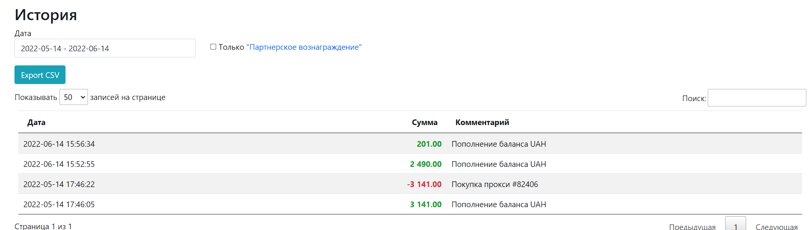

 #### Tags:
#💻  #js #🌱

---	

# | | (ИЛИ)

1.	Вычисляет операнды слева направо.
2.	Каждый операнд конвертирует в логическое значение. Если результат true, останавливается и возвращает исходное значение этого операнда.
3.	Если все операнды являются ложными(false), возвращает значение последнего из них .

```js
//Первый true это 1 
console.log(l || 0);
//Первый true это true
console.log(true || 'фрилансер');
//Первый true это 58
console.log(null || 58);
//Первый true это фрилансер
console.log(null || 'фрилансер' || 0);
//true нет совсем, вернет последнее значение - в
console.log(undefined || ” || null || |);
```

```js
//Сокращённое вычисление. Условие.
let admins = 0;
let users = 5;
admins > users || users++ 
console.log(users);  // 6

```

# && (И)
1.	Вычисляет операнды слева направо. 
2.	Каждый операнд преобразует в логическое значение.
Если результат false, останавливается и возвращает исходное значение этого операнда, если true продолжает работу пока не найдёт false или  этап - 3.
3.	Если все операнды были истинными, возвращает значение последнего.

```js
//Пример 1. в - faLse
console.log('Фрилансер' && 0 && 2 && 3)  //0
//Пример 2. nuLL - faLse
console.log(l && 2 && null && 3); // null
//Пример 3. Все true
console.log('15' && '42'); // 42
```

	приоритет оператара && больше, чем оператора ||

```js
console.log(1 && 0 || && 1);

Поскольку приоритет оператора && выше он будет обрабатыватся первым. 1) 0 false 2) 1 false) 3) 1 true 
```

```js 
//Подобие условия let users = 0;
(users > 0) && console.log(`Пользователей ${users}`);
```

Напишите условие `if` для проверки, что переменная `age` находится в диапазоне между `14` и `90` включительно.

«Включительно» означает, что значение переменной `age` может быть равно `14` или `90`. 

	Решение
```js 

	if (age >= 14 && age <= 90)
```


# ! (НЕ)
1.	Сначала приводит аргумент к логическому типу true / false.
2.	Затем возвращает противоположное значение.	
				 
		Имеет  наивысший приоритет 
		
	
``` js 
//Разные типы
console.log(!null);   // true 
console.log(!1);      // false 
console.log(!'');     // true 
console.log(!'фрилансер')    // false 
```

```js
console.log(!true && 58  // false
```

## !! (НЕ в boolean тип )
```js
//Используется для преобразования типа в booLean:
	сonsole.log(!!'фрилансер');
//или , равносильно 
	zonsole.log(Boolean('фрилансер'));
```

-------

Напишите условие `if` для проверки, что значение переменной `age` НЕ находится в диапазоне `14` и `90` включительно.

Напишите два варианта: первый с использованием оператора НЕ `!`, второй – без этого оператора.

	решение
```js
	if (!(age >= 14 && age <= 90))
	Второй вариант:
	if (age < 14 || age > 90)
```


## ?? 
Оператор ?? возвращает первый аргумент, если он не null / undefined, иначе второй. 
	
#### Links:
   [[]]	
   [[]]
	
##### Source:
   [JSL](https://learn.javascript.ru/logical-operators)
	
		
	
