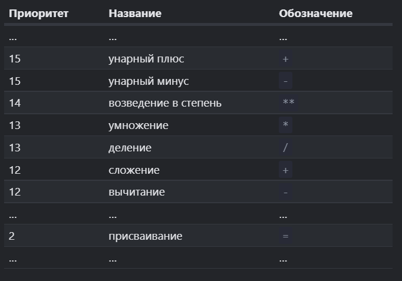

 #### Tags:
#🌱  #js  #💻 

---	
-   _Операнд_ – то, к чему применяется оператор. Например, в умножении `5 * 2` есть два операнда: левый операнд равен `5`, а правый операнд равен `2`. Иногда их называют «аргументами» вместо «операндов».	

- _Унарным_ называется оператор, который применяется к одному операнду. Например, оператор унарный минус `"-"` меняет знак числа на противоположный:
```js
	let x = 1; _x = -x;_ alert( x ); // -1, применили унарный минус
```

- Бинарным - называется оператор, который применяется к двум операндам. Тот же минус существует и в бинарной форме:
```js
	let x = 1, y = 3;
	alert( y - x ); // 2, бинарный минус вычитает значения`
```
 
    Формально, в последних примерах мы говорим о двух разных операторах, использующих один символ: оператор отрицания (унарный оператор, который обращает знак) и оператор вычитания (бинарный оператор, который вычитает одно число из другого).

	
## Бинарный + 
```JS
	let s = "моя" + "строка"; 
	alert(s); // моястрока
```

Обратите внимание, если хотя бы один операнд является строкой, то второй будет также преобразован в строку.
```JS
alert(2 + 2 + '1' ); // будет "41", а не "221"
```


	Сложение и преобразование строк — это особенность бинарного плюса `+`. Другие арифметические операторы работают только с числами и всегда преобразуют операнды в числа.


## Унарный +
```JS
	let apples = "2"; 
	let oranges = "3"; 
	// оба операнда предварительно преобразованы в числа 
	alert( +apples + +oranges );  
	alert( Number(apples) + Number(oranges) ); 
	// более длинный вариант // 
	// alert( Number(apples) + Number(oranges) ); // 5

```

Так как «унарный плюс» имеет приоритет `15`, который выше, чем `12` у «сложения» (бинарный плюс), то в выражении `"+apples + +oranges"` сначала выполнятся унарные плюсы, а затем сложение.


## Возведение в степень **
В выражении `a ** b` оператор возведения в степень умножает `a` на само себя `b` раз.
```JS
	alert( 2 ** 2 ); // 4 (2 умножено на себя 2 раза) 
	alert( 2 ** 3 ); // 8 (2 * 2 * 2, 3 раза)
	 
	alert( 2 ** 4 ); // 16 (2 * 2 * 2 * 2, 4 раза)
```


```JS
	alert( 4 ** (1/2) ); // 2 (степень 1/2 эквивалентна взятию квадратного корня) 
	alert( 8 ** (1/3) ); // 2 (степень 1/3 эквивалентна взятию кубического корня)
```


# Приоритет операторов


## Присваивание 

### Присваивание = возвращает значение

Вызов `x = value` записывает `value` в `x` _и возвращает его_.

Благодаря этому присваивание можно использовать как часть более сложного выражения:

```js
	let a = 1; 
	let b = 2;  
	
	let c = 3 - (a = b + 1);
	
	alert( a ); // 3
	alert( c ); // 0`
```

В примере выше результатом `(a = b + 1)` будет значение, которое присваивается переменной `a` (то есть `3`). Потом оно используется для дальнейших вычислений.


## Присваивание по цепочке 
```JS
	let a, b, c; 
	
	a = b = c = 2 + 2;
	
	alert( a ); // 4 
	alert( b ); // 4 
	alert( c ); // 4
```
Такое присваивание работает справа налево. Сначала вычисляется самое правое выражение `2 + 2`, и затем результат присваивается переменным слева: `c`, `b` и `a`. В конце у всех переменных будет одно значение.

Опять-таки, чтобы код читался легче, лучше разделять подобные конструкции на несколько строчек:

## Сокращённая арифметика с присваиванием


```JS
	let n = 2; 
	n = n + 5; 
	n = n * 2;


	let n = 2; 
	n += 5; // теперь n = 7 (работает как n = n + 5) 
	n *= 2; // теперь n = 14 (работает как n = n * 2) 
	alert( n ); // 14


	let n = 2; 
	
	n *= 3 + 5; 
	
	alert( n ); // 16 (сначала выполнится правая часть, выражение идентично n *= 8)
```
	такой же приоритет, как обычное присваивание
Подобные краткие формы записи существуют для всех арифметических и побитовых операторов: `/=`, `-=` и так далее.


## Инкремент/декремент

**Инкремент** `++` увеличивает переменную на 1:

`counter++`.
`++counter`.
```JS
	let counter = 2; 
	counter++; // работает как counter = counter + 1, просто запись короче 
	
	alert( counter ); // 3
```

**Декремент** `--` уменьшает переменную на 1:

```JS
	let counter = 2; 
	counter--; // работает как counter = counter - 1, просто запись короче 
	alert( counter ); // 1
```


> ! Важно:
>Инкремент/декремент можно применить только к переменной. Попытка использовать его на значении, типа 5++, приведёт к ошибке.

Операторы `++` и `--` могут быть расположены не только после, но и до переменной.

-   Когда оператор идёт после переменной — это «постфиксная форма»: `counter++`.
-   «Префиксная форма» — это когда оператор идёт перед переменной: `++counter`.


```js 
•   Если результат оператора не используется, а нужно только увеличить/уменьшить переменную, тогда без разницы, какую форму использовать:

    let counter = 0; 
    counter++; 
    ++counter; 
    alert( counter ); // 2, обе строки сделали одно и то же`
    
•   Если хочется тут же использовать результат, то нужна префиксная форма:
    
    
    let counter = 0; 
    alert( ++counter ); // 1`
    
•   Если нужно увеличить и при этом получить значение переменной _до увеличения_ – нужна постфиксная форма:
    
    let counter = 0; 
    alert( counter++ ); // 0`

```


## Побитовые операторы
Побитовые операторы работают с 32-разрядными целыми числами (при необходимости приводят к ним), на уровне их внутреннего двоичного представления.

Эти операторы не являются чем-то специфичным для JavaScript, они поддерживаются в большинстве языков программирования.

Поддерживаются следующие побитовые операторы:

-   AND(и) ( `&` )
-   OR(или) ( `|` )
-   XOR(побитовое исключающее или) ( `^` )
-   NOT(не) ( `~` )
-   LEFT SHIFT(левый сдвиг) ( `<<` )
-   RIGHT SHIFT(правый сдвиг) ( `>>` )
-   ZERO-FILL RIGHT SHIFT(правый сдвиг с заполнением нулями) ( `>>>` )

Они используются редко, когда возникает необходимость оперировать с числами на очень низком (побитовом) уровне. В ближайшем времени они нам не понадобятся, так как веб-разработчики редко к ним прибегают, хотя в некоторых сферах (например, в криптографии) они полезны. Можете прочитать [раздел о них](https://developer.mozilla.org/ru/docs/Web/JavaScript/Guide/Expressions_and_Operators#%D0%91%D0%B8%D1%82%D0%BE%D0%B2%D1%8B%D0%B5_%D0%BF%D0%BE%D1%80%D0%B0%D0%B7%D1%80%D1%8F%D0%B4%D0%BD%D1%8B%D0%B5_%D0%BE%D0%BF%D0%B5%D1%80%D0%B0%D1%82%D0%BE%D1%80%D1%8B) на MDN, когда возникнет реальная необходимость.


## [Оператор «запятая»](https://learn.javascript.ru/operators#operator-zapyataya)


```JS
	"" + 1 + 0 = "10" // (1) 
	"" - 1 + 0 = -1 // (2) 
	true + false = 1 
	6 / "3" = 2 
	"2" * "3" = 6 
	4 + 5 + "px" = "9px" 
	"$" + 4 + 5 = "$45" 
	"4" - 2 = 2
	"4px" - 2 = NaN 
	7 / 0 = Infinity 
	" -9 " + 5 = " -9 5" // (3) 
	" -9 " - 5 = -14 // (4) 
	null + 1 = 1 // (5) 
	undefined + 1 = NaN // (6) 
	" \t \n" - 2 = -2 // (7
```

1.  Сложение со строкой `"" + 1` преобразует `1` к строке: `"" + 1 = "1"`, и в следующем случае `"1" + 0` работает то же самое правило.
2.  Вычитание `-` (как и большинство математических операторов) работает только с числами, пустая строка `""` приводится к `0`.
3.  Сложение со строкой превращает число `5` в строку и добавляет к строке.
4.  Вычитание всегда преобразует к числу, значит строка `" -9 "` становится числом `-9` (пробелы по краям обрезаются).
5.  `null` становится `0` после численного преобразования.
6.  `undefined` становится `NaN` после численного преобразования.
7.  Пробельные символы, такие как `\t` и `\n`, по краям строки игнорируются при преобразовании в число, так что строка `" \t \n"`, аналогично пустой строке, становится `0` после численного преобразования.


#### Links:
   [[]]	
   [[]]
	
##### Source:
   [learn js](https://learn.javascript.ru/operators#prisvaivanie-vozvraschaet-znachenie)
	
		
	
