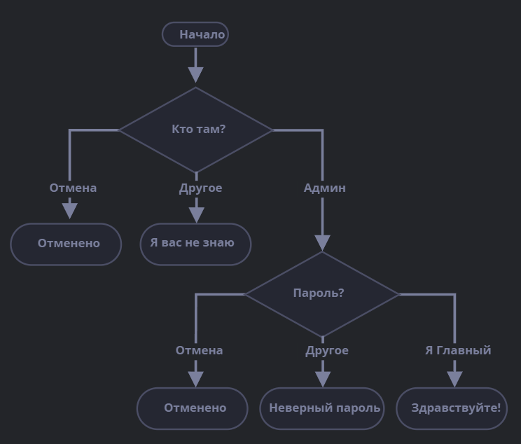

 #### Tags:
 #js  #🌱  #💻 


---	
## If 
#practice

Любая строка, кроме пустой (а строка `"0"` – не пустая), в логическом контексте становится `true`.

Можно запустить и проверить:


```js
let year = prompt('В каком году была опубликована спецификация ECMAScript-2015?', ''); 

	if (year < 2015) {
	alert( 'Это слишком рано...' ); } 
	
	else if (year > 2015) { 
	alert( 'Это поздновато' ); } 
	
	else { 
	alert( 'Верно!' ); }
```
	
Напишите код, который будет спрашивать логин с помощью `prompt`.

Если посетитель вводит «Админ», то `prompt` запрашивает пароль, если ничего не введено или нажата клавиша Esc – показать «Отменено», в противном случае отобразить «Я вас не знаю».

Пароль проверять так:

-   Если введён пароль «Я главный», то выводить «Здравствуйте!»,
-   Иначе – «Неверный пароль»,
-   При отмене – «Отменено».

Блок-схема:
```js
	let userName = prompt("Кто там?", ''); 
	if (userName === 'Админ') { 
	
	let pass = prompt('Пароль?', ''); 
	
	
	if (pass === 'Я главный') { 
	alert( 'Здравствуйте!' ); 
	
	} else if (pass === '' || pass === null) { 
         alert( 'Отменено' ); 
       
       } else { alert( 'Неверный пароль' ); 
       } 


       } else if (userName === '' || userName === null) { 
       alert( 'Отменено' ); } 
       
       else { alert( "Я вас не знаю" );
```


--------------

```js
 
var date = new Date();  
var time = date.getHours();  
  
if (time < 10) {  
  alert( "Доброе утро!" );  
}  
  else if (time >= 10 && time < 16) {  
  alert( "Добрый день!" );  
}  
  else if (time>=16 && time < 20) {  
  alert( "Добрый вечер!" );  
}  
  else {  
  alert( "Доброй ночи!" );  
}
```

	
## [Условный оператор „?“](https://learn.javascript.ru/ifelse#uslovnyy-operator)	
	
```js
let accessAllowed = (age > 18) ? true : false;
```

>// оператор сравнения "age > 18" выполняется первым в любом случае // (нет необходимости заключать его в скобки) let accessAllowed = age > 18 ? true : false;
	
>На заметку:
В примере выше вы можете избежать использования оператора вопросительного знака `?`, т.к. сравнение само по себе уже возвращает `true/false`:
`// то же самое let accessAllowed = age > 18;`	
	
	
### Несколько операторов ? 
```js
	let age = prompt('Возраст?', 18); 
	
	let message = (age < 3) ? 'Здравствуй, малыш!' : 
	
	(age < 18) ? 'Привет!' : 
	
	(age < 100) ? 'Здравствуйте!' :
	 
	'Какой необычный возраст!'; 
	
	alert( message );
```

Вот как это выглядит при использовании `if..else`:

```js
let age = prompt('Возраст?', 18);

	if (age < 3) {
	    message = 'Здравствуй, малыш!';
	  } else if (age < 18) {
	    message = 'Привет!';
	  } else if (age < 100) {
	    message = 'Здравствуйте!';
	  } else {
	    message = 'Какой необычный возраст!';
	  }
	
	  alert(message);
```


### Нетрадиционное использование „?“
```js
	let company = prompt('Какая компания создала JavaScript?', ''); 
	
	(company == 'Netscape') ? 
	
	alert('Верно!') : 
	
	alert('Неправильно.');_
```

Вот, для сравнения, тот же код, использующий `if`:

``` js
	let company = prompt('Какая компания создала JavaScript?', '');  
	
	if (company == 'Netscape') {  
	 
       alert('Верно!'); 
       
       }  else {  
	
       alert('Неправильно.'); 
       }
      
```
	
#### Links:
   [[]]	
   [[]]
	
##### Source:
   []()
	
		
	
